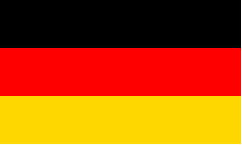

# Alıştırmalar

1. `DrRacket` programını [web sayfasından](https://download.racket-lang.org/) indirerek bilgisayarımıza kuralım!

```
https://download.racket-lang.org/
```

2. Derste anlatıldığı gibi `DrRacket` için dil ve eğitim paketi ayarlarını yapalım. Dil olarak `Schreibe Dein Programm - Anfänger`, eğitim paketi olarak da `Image.rkt` secelim. 

3. Aşağıdaki matematiksel ifadeleri `racket` diline çevirerek `Etkileşim Penceresi`'nde çalıştıralım:
 
```
42 * 6
23 + (42 / 7)
(12 * 5) + (4 * (22 + 17))
34 - 14 * 2 + 12 / 4
```

3. Aşağıdaki değerlerin hangi türde olduklarını tahmin edebilir misin? `string?`, `number?`, `boolean?` ve `image?` fonksiyonlarını kullanarak doğru tahmin edip etmediğini test edebilirsin.

- 42
- "56"
- 46.5
- 15/7
- "number"
- #t
- #true
- "true"
- True 
- 


4. Şimdiye kadar öğrendiklerimizi kullanarak Almanya'nın bayrağını çizebilir misin? Siyah, kırmızı ve altın rengi olmak üzere 3 tane dikdörtgene ihtiyacımız var. Bunları üst üste koyarsak oldu demektir:

