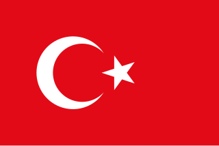

# Ev Ödevi

1. Racket dili tarafından tanımlanmış [circle](../misc/documentation.md#circle), [rectangle](../misc/documentation.md#rectangle), [star](../misc/documentation.md#star), [overlay](../misc/documentation.md#overlay) ve [overlay/xy](../misc/documentation.md#overlayxy) gibi fonksiyonları kullanarak Türk Bayrağımızı çizelim!

